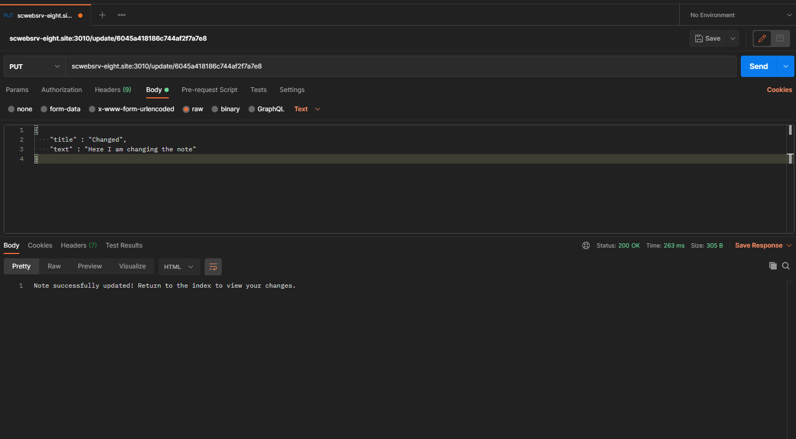

# Mongoose-Tutorial

## This is an overview readme file for this API CRUD tutorial using Mongoose and Node.js

### Getting Started
First of all, welcome! This API is structured so that the controllers, routes, models, and connection files are all in their own directory.  
The first thing you're going to want to do is create a directory to put the app in. After that you'll want to initialize the Node Package Manager in that directory with your terminal.
```
npm init
```
You can use npm to install the dependency packages first:
```
npm install express body-parser mongoose
```
Or you can just download this app, and those dependencies should come with it.

### MongoDB Connection 
The connection file *connection.js* inside the db directory controls the connection to the Mongo Database we are using to store the data for our little note taking app. Because all of these files need to communicate with each other for the app to function we have used the module.exports to make it available for other files to access with the require method.

### Virtual Server
The main file that will set up the structure of the server is called *index.js*. This file adds all of the packages that were installed with the Node Package Manger (they are all inside the package.json file as dependencies) and sets the server to use port 3010 to run on.  

Express handles the routing and the middleware in Node.js and on this page we've defined the express() method as the variable *app* and **app.use()** is a method for setting middleware. 

### Routes
I'll be using these routes in my router file to demonstrate the 4 basic CRUD operations of GET, POST, PUT, and DELETE.  
```js
router.get('/', noteCtrl.displayIndex); // GET is used to display data


router.post('/post', noteCtrl.createNote); // POST is used to send data


router.put('/update/:id', noteCtrl.updateNote); // PUT is used to update data


router.delete('/delete/:id', noteCtrl.destroyNote); // DELETE is used to... delete data. I'm serious.

```
Express uses callbacks to execute its code, as you can see in the above examples. These callbacks are called *Middleware* and they include all of the queries and other code associated with each route. Those middleware functions are all defined on the controller file **note-ctrl.js**

### Models
Mongoose uses Schemas and Models to facilitate all of it's communications with the database. A Mongoose schema is like a template for how your data will be saved and a model is how Mongoose uses that template to make queries or create documents.  

For this CRUD API we are only using one Schema which gets exported as a model.

### Controllers
The controllers file is where the functions that run the operations of the note taking app are stored. Each route uses these functions as callbacks in order to run unblocking code which is a way of saying that it is asynchronous. By using these callback functions the script reader can ready these functions to fire and continue reading the script all the way to the end which makes it much more efficient.


### Let's See it in Action!
This is the GET request on the index route "/" done in Postman:   
  

This is the POST request on the router.post route "/post" in Postman:    
  

This is the PUT request on the router.put route "/put" in Postman:  
    

This is the DELETE request on the router.delete route "/delete" in Postman:  
  